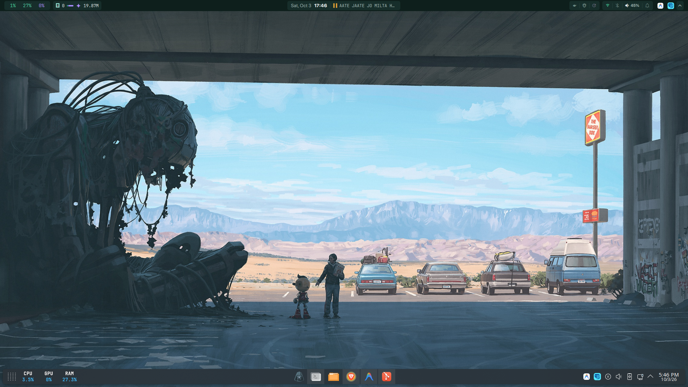
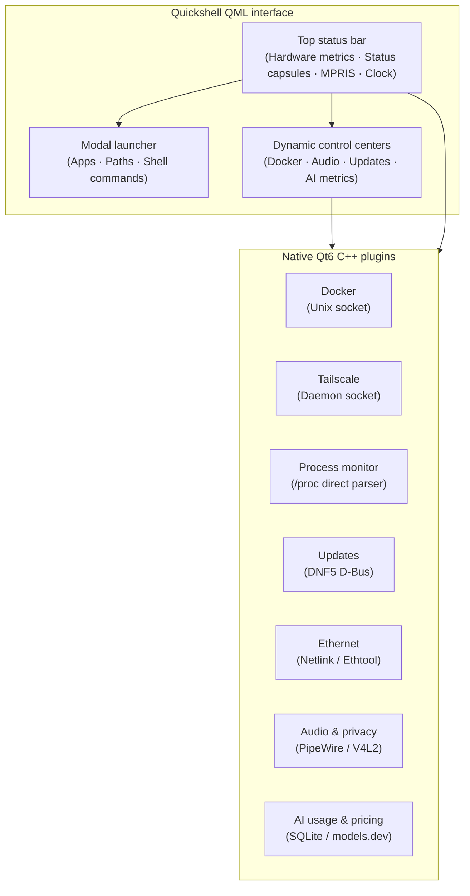
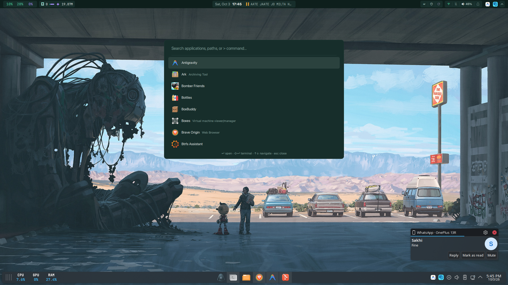
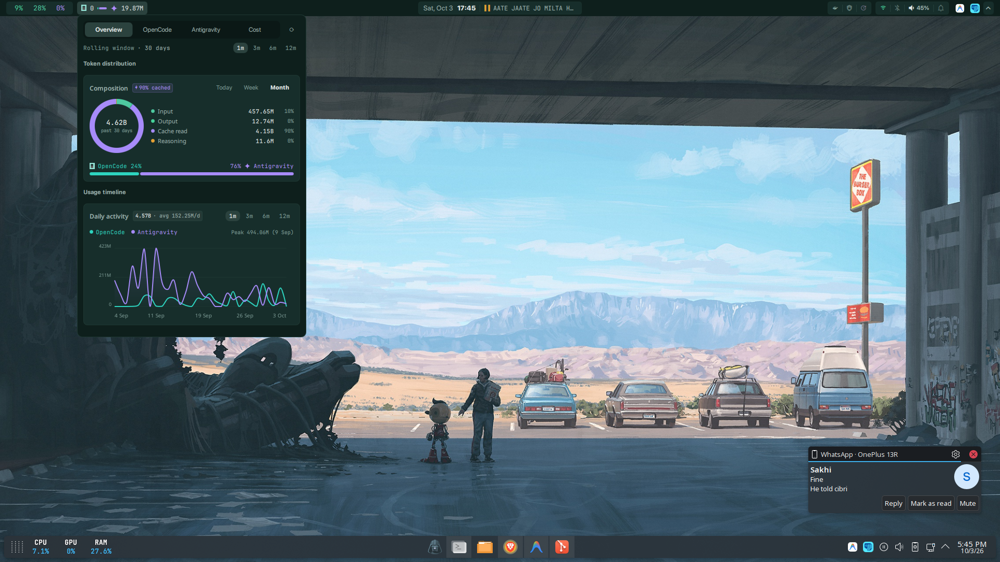
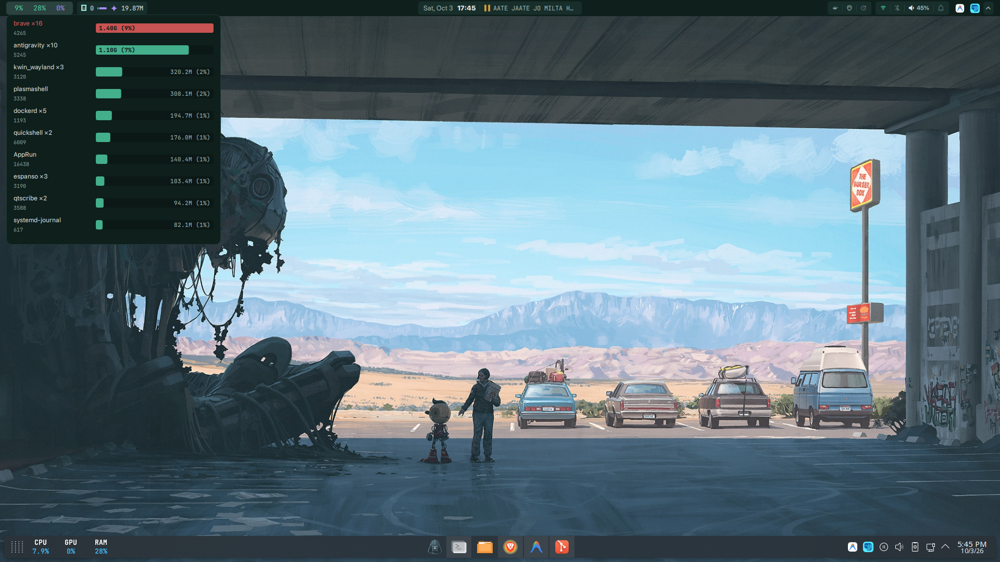
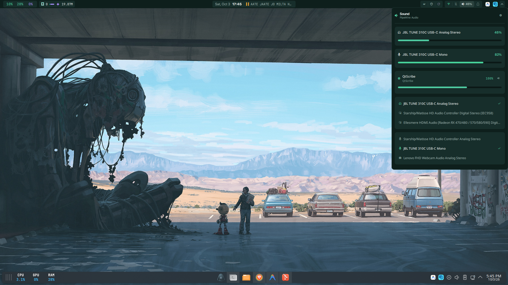
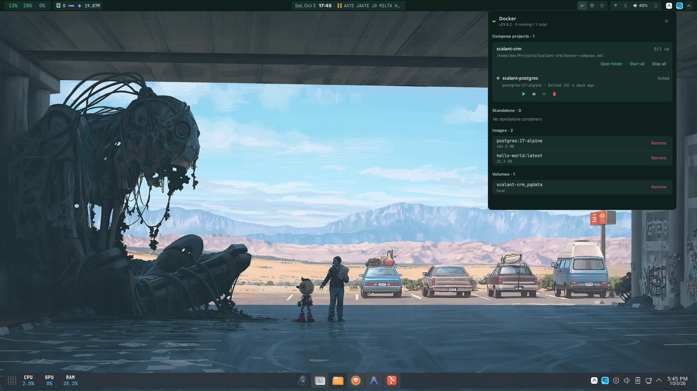

# quick-shell

Personal desktop bar, application launcher, and system control center built on [Quickshell](https://quickshell.org) and Qt6 for Fedora Linux with KDE Plasma on KWin Wayland.



## Visual flow

The shell combines a declarative QML interface with compiled C++ plugins that query hardware, sockets, and system daemons directly without spawning shell subprocesses.



## Views and controls

### Application launcher

Spotlight-style fuzzy search across desktop applications, direct filesystem path navigation, and inline shell command execution.



### AI usage and cost analytics

Tracks daily token consumption, cache hits, and model distribution across OpenCode and Antigravity sessions, pairing local metrics with live pricing from models.dev.



### System performance and top processes

Live CPU, RAM, and GPU load monitoring with an on-demand process inspector parsed directly from `/proc`.



### PipeWire audio and device controls

Stream volume sliders, sink and source routing, and per-application volume controls.



### Docker container manager

Live container states, logs, and compose project lifecycle management via the local Docker socket.



## Build and installation

Build all 11 native C++ plugins using CMake and Ninja:

```bash
cmake -S . -B build -G Ninja -DCMAKE_BUILD_TYPE=Release
cmake --build build
```

To build an individual plugin:

```bash
cmake --build build --target docker
```

Run QML static analysis across the interface:

```bash
cmake --build build --target qmllint
```

## Running

Launch the shell with Quickshell:

```bash
quickshell -p /home/dev/Projects/quick-shell
```

Quickshell hot-reloads interface changes automatically when QML files are edited.

## IPC controls

Interact with the running shell from terminal commands, scripts, or KWin window manager shortcuts:

```bash
# Toggle application launcher
quickshell ipc call launcher toggle

# Open control centers
quickshell ipc call popup open proc       # Top processes
quickshell ipc call popup open ai         # AI token usage
quickshell ipc call popup open vol        # PipeWire volume
quickshell ipc call popup open docker     # Docker containers
quickshell ipc call popup open ts         # Tailscale nodes
quickshell ipc call popup open update     # DNF5 package updates

# Dismiss open popups
quickshell ipc call popup close
```
